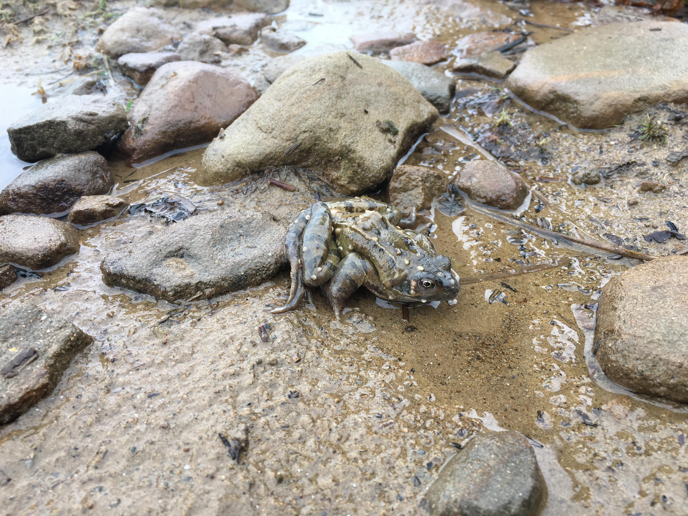

## Alport Bridge
There isn't a huge amount of parking available at Alport Bridge just a small area that can fit a couple of cars, three at a push. So you'll either have to set off early or, like us head up mid week or when the weather is looking a little crap.

The path heads over the River Alport with the dam to your right. Part of the path will lead back up the Alport aquaduct which feeds the Derwent reservoir. Follow the farm track up to the road rather than sneaking along the aqueduct path to your left.

Lorem ipsum dolor sit amet, consectetur adipisicing elit, sed do eiusmod tempor incididunt ut labore et dolore magna aliqua. Ut enim ad minim veniam, quis nostrud exercitation ullamco laboris nisi ut aliquip ex ea commodo consequat. Duis aute irure dolor in reprehenderit in voluptate velit esse cillum dolore eu fugiat nulla pariatur. Excepteur sint occaecat cupidatat non proident, sunt in culpa qui officia deserunt mollit anim id est laborum.

Lorem ipsum dolor sit amet, consectetur adipisicing elit, sed do eiusmod tempor incididunt ut labore et dolore magna aliqua. Ut enim ad minim veniam, quis nostrud exercitation ullamco laboris nisi ut aliquip ex ea commodo consequat. Duis aute irure dolor in reprehenderit in voluptate velit esse cillum dolore eu fugiat nulla pariatur. Excepteur sint occaecat cupidatat non proident, sunt in culpa qui officia deserunt mollit anim id est laborum.

Lorem ipsum dolor sit amet, consectetur adipisicing elit, sed do eiusmod tempor incididunt ut labore et dolore magna aliqua. Ut enim ad minim veniam, quis nostrud exercitation ullamco laboris nisi ut aliquip ex ea commodo consequat. Duis aute irure dolor in reprehenderit in voluptate velit esse cillum dolore eu fugiat nulla pariatur. Excepteur sint occaecat cupidatat non proident, sunt in culpa qui officia deserunt mollit anim id est laborum.

Having passed the Hope cross and enjoyed the views up the Hope valley towards Edale or original plan was to press on to the pub near the reservoir to find some lunch. However early Febuary and late starts don't really mix so we decided to cut the walk short at this point. We chose the next path that cuts down to the reservoir side thorugh the woods and after some recent heavy rain, the path was a mix of rock, mud and moss.

The path finally breaks through to a bridleway which provides a relatively simple route down to the waters edge. However we opted to take the slightly shorter route straight down the side of the hill. What started as a simple path quickly became a steep, slippery, muddy track down between the trees. If it has been raining alot I would opt for the wider rocky path...

The track joins the path that runs along the southern edge of the reservoir. Follow this round ignoring the two bridges across towards the Snake path. You should eventually pass an access hatch to the aqueduct before passing a few gates and along a muddy track to the aqueduct overflow.

The path then runs paralell to the aqueduct back towards the track where we first set out.

