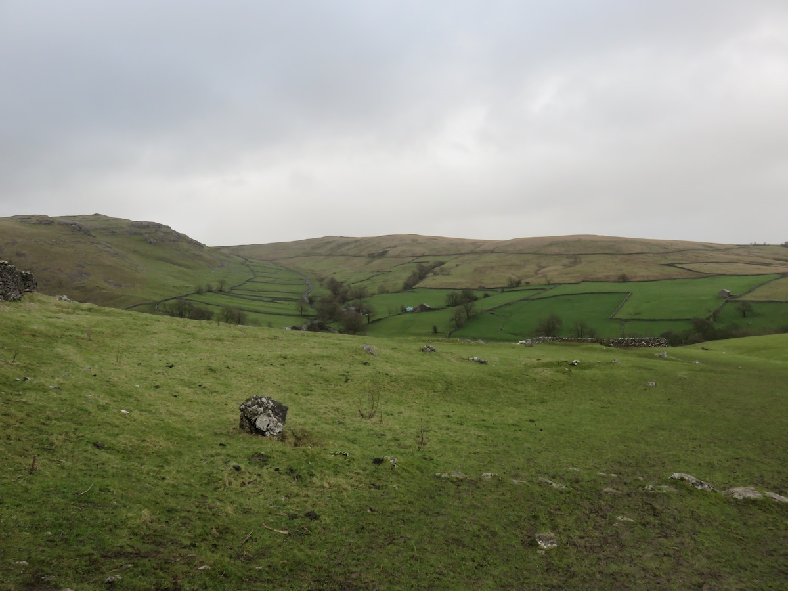

Malham just East of Skipton is home to some of the most spectacular scenery in Yorkshire. This walk takes in the geological sites of Goredale Scar, Malham Tarn and Malham cove with a Roman fort for those willing to brave the wind.

